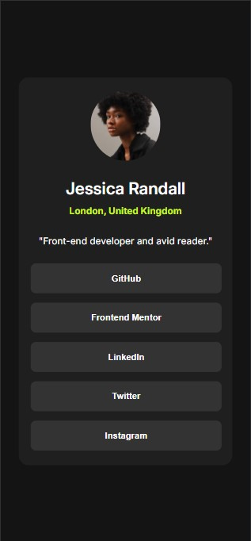

# Frontend Mentor - Social links profile solution

This is a solution to the [Social links profile challenge on Frontend Mentor](https://www.frontendmentor.io/challenges/social-links-profile-UG32l9m6dQ). Frontend Mentor challenges help you improve your coding skills by building realistic projects. 

## Table of contents

- [Overview](#overview)
  - [The challenge](#the-challenge)
  - [Screenshot](#screenshot)
  - [Links](#links)
- [My process](#my-process)
  - [Built with](#built-with)
  - [What I learned](#what-i-learned)
  - [Continued development](#continued-development)
- [Author](#author)

## Overview

### The challenge

Users should be able to:

- See hover and focus states for all interactive elements on the page

### Screenshot

Desktop Version

Mobile Version

Active State

### Links

- Solution URL: [GitHub page URL](https://github.com/AgnerShimokawa/social-links-profile)
- Live Site URL: [Live site URL](https://agnershimokawa.github.io/social-links-profile/)

## My process

### Built with

- Semantic HTML5 markup
- CSS custom properties

### What I learned

I leared a little bit more about alignment of the elements by having everything as close to the actual design. Also I got more comfortable with creating responsive designs.

### Continued development

There's still a few things that I need to better understand, however by doing more challenges I feel like there's going to be a lot more improvement.

## Author

- GitHub Page - [AgnerShimokawa](https://github.com/AgnerShimokawa)
- Frontend Mentor - [@AgnerShimokawa](https://www.frontendmentor.io/profile/AgnerShimokawa)
- Twitter - [Agner Shimokawa](https://www.linkedin.com/in/agner-shimokawa/)